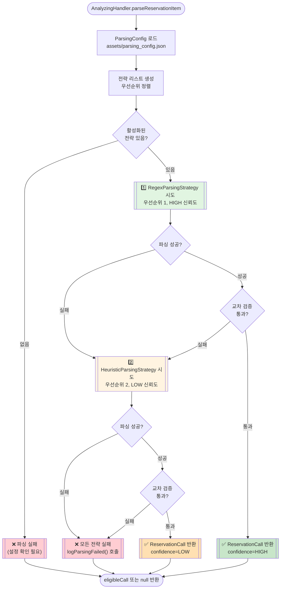

# Vortex Parsing Strategy 가이드 (Phase 1)

## 1. 개요

Vortex는 **Strategy Pattern 기반 2단계 Fallback 파싱**을 사용하여 콜 리스트 아이템을 파싱합니다.

### 핵심 개념

- **정규식 우선 (HIGH 신뢰도)**: assets/parsing_config.json의 정규식 패턴으로 모든 필드 추출
- **휴리스틱 Fallback (LOW 신뢰도)**: 정규식 실패 시 순서 기반 텍스트 할당
- **교차 검증**: 파싱 결과가 가격 범위(2000~300000원), 경로 길이(>=2자) 검증 통과해야 승인
- **설정 기반**: JSON 파일로 정규식, 검증 규칙 관리 (앱 재빌드 없이 수정 가능)

---

## 2. 아키텍처

```
domain/
├── model/
│   └── ReservationCall.kt          # confidence, debugInfo 필드 추가
└── parsing/                         # ⭐ Phase 1 신규 패키지
    ├── ParseConfidence.kt           # HIGH (1.0), LOW (0.3) enum
    ├── ParsingConfig.kt             # assets/parsing_config.json 로더 (Singleton)
    └── ParsingStrategy.kt           # 전략 인터페이스 + 2개 구현체
        ├── ParsingStrategy          # 인터페이스 (name, priority, parse())
        ├── RegexParsingStrategy     # 우선순위 1, HIGH 신뢰도
        └── HeuristicParsingStrategy # 우선순위 2, LOW 신뢰도

assets/
└── parsing_config.json              # 정규식 패턴, 검증 규칙, 파싱 설정
```

### 파싱 대상 View ID (item_reservation_list.xml)

콜 리스트 아이템의 텍스트 수집 대상 (상세 내용은 `docs/ViewIdlist.md` 참조):

| View ID | 타입 | 파싱 용도 |
|---------|------|----------|
| `tv_reserved_at` | TextView | **예약 시간 및 콜 타입** (예: "01.10(토) 13:20 / 1시간 예약") |
| `tv_path` | TextView | **출발지 → 도착지** (예: "(청담동) ... → (서울 전농1동) ...") |
| `tv_fare` | TextView | **요금** (예: "요금 50,000원") |
| `tv_stopovers` | TextView | 경유지 정보 (선택사항) |
| `vg_item` | FrameLayout | **클릭 대상** (bounds 추출) |

---

## 3. 파싱 플로우



---

## 4. ParsingStrategy 인터페이스

```kotlin
/**
 * 콜 파싱 전략 인터페이스 (Strategy Pattern)
 */
interface ParsingStrategy {
    /**
     * 전략 이름 (로깅용)
     */
    val name: String

    /**
     * 실행 우선순위 (낮을수록 먼저 실행)
     */
    val priority: Int

    /**
     * 콜 아이템 노드를 파싱하여 ReservationCall 반환
     *
     * @param itemNode 콜 아이템 노드
     * @param config 파싱 설정
     * @return 파싱 성공 시 ParseResult, 실패 시 null
     */
    fun parse(itemNode: AccessibilityNodeInfo, config: ParsingConfig): ParseResult?
}

/**
 * 파싱 결과 (ReservationCall + 신뢰도 + 디버깅 정보)
 */
data class ParseResult(
    val call: ReservationCall,
    val confidence: ParseConfidence,
    val debugInfo: Map<String, Any> = emptyMap()
)
```

---

## 5. 전략 비교

### 5.1 RegexParsingStrategy (우선순위 1)

| 항목 | 값 |
|------|-----|
| **우선순위** | 1 (가장 먼저 실행) |
| **신뢰도** | `ParseConfidence.HIGH` (1.0) |
| **파싱 방식** | config의 정규식 패턴 사용 |
| **Fallback** | 경로 패턴 실패 시 휴리스틱으로 경로만 보완 |
| **장점** | 정확한 패턴 매칭, 노이즈 제거 |
| **단점** | 정규식 패턴이 맞지 않으면 실패 |

**파싱 과정:**
```
1. 모든 텍스트 수집 (collectAllText)
2. 정규식 패턴으로 필드 추출:
   - price: (\\d{1,3}(,\\d{3})*|\\d+)\\s*원
   - time: \\d{2}\\.\\d{2}\\([^)]+\\)\\s+\\d{2}:\\d{2}.*
   - route: (.+)\\s*→\\s*(.+)
3. 경로 패턴 실패 시:
   - 화살표(→) 텍스트 확인
   - 없으면 순서대로 할당 (숫자 제외)
4. 필수 필드 검증 (reservationTime, route, price)
5. ReservationCall 생성 (confidence=HIGH)
```

### 5.2 HeuristicParsingStrategy (우선순위 2)

| 항목 | 값 |
|------|-----|
| **우선순위** | 2 (Fallback) |
| **신뢰도** | `ParseConfidence.LOW` (0.3) |
| **파싱 방식** | 순서 기반 텍스트 할당 (기존 AnalyzingHandler 방식) |
| **Fallback** | 없음 (최종 전략) |
| **장점** | 정규식이 안 맞아도 파싱 가능 |
| **단점** | 레이아웃 변경에 취약 |

**파싱 과정:**
```
1. 모든 텍스트 수집 (collectAllText)
2. 순서대로 필드 할당:
   - price: "요금" + "원" 포함 텍스트에서 정규식으로 추출
   - time: TIME_PATTERN 매칭 (정규식 사용)
   - route: 화살표(→) 확인 → 없으면 순서대로 할당
3. 필수 필드 검증
4. ReservationCall 생성 (confidence=LOW)
```

---

## 6. ParseConfidence (파싱 신뢰도)

```kotlin
enum class ParseConfidence {
    /**
     * 높은 신뢰도 - 정규식 기반 파싱
     */
    HIGH,

    /**
     * 낮은 신뢰도 - 휴리스틱 기반 파싱
     */
    LOW;

    /**
     * 신뢰도 점수 (0.0 ~ 1.0)
     */
    fun toScore(): Float {
        return when (this) {
            HIGH -> 1.0f
            LOW -> 0.3f
        }
    }
}
```

**활용:**
- 로깅: `RemoteLogger.logCallParsed(..., confidence="HIGH")`
- 통계: 신뢰도별 파싱 성공률 추적
- 필터링: 향후 LOW 신뢰도 콜은 우선순위 낮춤 가능

---

## 7. ParsingConfig (설정 관리)

### 7.1 Singleton 패턴

```kotlin
val config = ParsingConfig.getInstance(context)

// 정규식 패턴 접근
val pricePattern: Regex = config.pricePattern
val timePattern: Regex = config.timePattern
val routePattern: Regex = config.routePattern

// 검증 규칙 접근
val priceMin: Int = config.priceMin          // 2000
val priceMax: Int = config.priceMax          // 300000
val locationMinLength: Int = config.locationMinLength  // 2

// 파싱 설정 접근
val minTextCount: Int = config.minTextCount  // 2
val isRegexEnabled: Boolean = config.isRegexEnabled
val isHeuristicEnabled: Boolean = config.isHeuristicEnabled
```

### 7.2 JSON 설정 파일 (assets/parsing_config.json)

```json
{
  "version": "1.0.0",
  "app_version": "KakaoT v5.2.3",
  "last_updated": "2026-01-06",

  "patterns": {
    "price": {
      "regex": "(\\d{1,3}(,\\d{3})*|\\d+)\\s*원",
      "description": "금액 패턴 (예: 15,000원, 15000원)"
    },
    "time": {
      "regex": "\\d{2}\\.\\d{2}\\([^)]+\\)\\s+\\d{2}:\\d{2}.*",
      "description": "예약 시간 패턴 (예: 01.10(목) 14:30)"
    },
    "route": {
      "regex": "(.+)\\s*→\\s*(.+)",
      "description": "경로 패턴 (출발지 → 도착지)"
    }
  },

  "validation": {
    "price_min": 2000,
    "price_max": 300000,
    "location_min_length": 2,
    "reservation_time_required": true
  },

  "parsing": {
    "min_text_count": 2,
    "enable_regex_strategy": true,
    "enable_heuristic_strategy": true
  }
}
```

### 7.3 설정 수정 시나리오

**시나리오**: 카카오T 앱 업데이트로 금액 표시 형식이 "15,000원" → "₩15,000"으로 변경

**기존 방식 (하드코딩)**:
```kotlin
// AnalyzingHandler.kt 수정
private val PRICE_PATTERN = Regex("₩(\\d{1,3}(,\\d{3})*)")

// 앱 재빌드 → APK 재배포 필요
```

**Phase 1 방식 (JSON 설정)**:
```json
// assets/parsing_config.json 수정
{
  "patterns": {
    "price": {
      "regex": "₩(\\d{1,3}(,\\d{3})*)",
      "description": "새로운 금액 패턴"
    }
  }
}

// 앱 재빌드 → APK 재배포 필요 (assets 변경 시)
// 향후 개선: 서버에서 JSON 다운로드 → 재배포 불필요
```

---

## 8. 교차 검증 (validateParsedCall)

```kotlin
/**
 * 파싱된 콜 데이터 교차 검증
 */
private fun validateParsedCall(call: ReservationCall, config: ParsingConfig): Boolean {
    // 가격 범위 검증
    if (call.price < config.priceMin || call.price > config.priceMax) {
        Log.w(TAG, "가격 범위 초과: ${call.price}원 (허용: ${config.priceMin}~${config.priceMax})")
        return false
    }

    // 경로 길이 검증
    if (call.source.length < config.locationMinLength ||
        call.destination.length < config.locationMinLength) {
        Log.w(TAG, "경로 길이 부족: ${call.source} → ${call.destination}")
        return false
    }

    // 예약 시간 필수 검증
    if (config.reservationTimeRequired && call.reservationTime.isEmpty()) {
        Log.w(TAG, "예약 시간 누락")
        return false
    }

    return true
}
```

---

## 9. ReservationCall 확장 (Phase 1)

### 9.1 새 필드

```kotlin
data class ReservationCall(
    // ... 기존 필드 ...

    /**
     * 파싱 신뢰도 (Phase 1 추가)
     * - HIGH: 정규식으로 모든 필드 추출 성공
     * - LOW: 휴리스틱(순서 기반)으로 추출
     * - null: 구버전 호환성 (파싱 전략 미적용)
     */
    val confidence: ParseConfidence? = null,

    /**
     * 파싱 디버깅 정보 (Phase 1 추가)
     * - strategy: 사용된 파싱 전략 ("Regex", "Heuristic")
     * - matched_fields: 매칭된 필드 목록
     * - text_count: 수집된 텍스트 개수
     */
    val debugInfo: Map<String, Any> = emptyMap()
)
```

### 9.2 로깅 예시

```kotlin
// AnalyzingHandler.kt
val confidenceStr = call.confidence?.name ?: "UNKNOWN"

Log.d(TAG, "콜 #$index: 타입=${call.callType}, 시간=${call.reservationTime}, 출발=${call.source}, 도착=${call.destination}, 금액=${call.price}원, 조건충족=$eligible, 신뢰도=$confidenceStr")

context.logger.logCallParsed(
    index = index,
    source = call.source,
    destination = call.destination,
    price = call.price,
    callType = call.callType,
    reservationTime = call.reservationTime,
    eligible = eligible,
    rejectReason = rejectReason,
    confidence = confidenceStr,          // Phase 1: 파싱 신뢰도
    debugInfo = call.debugInfo           // Phase 1: 디버깅 정보
)
```

---

## 10. 장점 및 개선 효과

### 10.1 유지보수성

```
기존 (하드코딩):
  ❌ 정규식 변경 시 AnalyzingHandler.kt 수정
  ❌ 앱 재빌드 + APK 재배포 필요
  ❌ 파싱 실패 시 디버깅 어려움

Phase 1 (Strategy + JSON):
  ✅ 정규식 변경 시 parsing_config.json 수정
  ✅ 앱 재빌드만 필요 (향후 서버 연동 시 재배포 불필요)
  ✅ confidence, debugInfo로 파싱 실패 원인 추적 가능
```

### 10.2 확장성

```
✅ 새 파싱 전략 추가 가능
   - 예: MLParsingStrategy (ML 모델 기반 파싱)
   - ParsingStrategy 인터페이스 구현 + priority 설정

✅ A/B 테스트 가능
   - 정규식 vs 휴리스틱 성능 비교 (confidence 기반)
   - 신뢰도별 수락률 분석

✅ 앱별 설정 관리
   - 카카오T, 우버, 타다 등 앱별 JSON 파일 관리
```

### 10.3 테스트 용이성

```kotlin
@Test
fun `RegexParsingStrategy should return HIGH confidence`() {
    val mockNode = createMockNode("15,000원", "강남역 → 서초역", "01.10(목) 14:30")
    val config = ParsingConfig.getInstance(context)
    val strategy = RegexParsingStrategy()

    val result = strategy.parse(mockNode, config)

    assertNotNull(result)
    assertEquals(ParseConfidence.HIGH, result?.confidence)
    assertEquals(15000, result?.call?.price)
}
```

---

## 11. 향후 개선 방향 (Phase 2+)

### 11.1 서버 기반 설정 관리

```kotlin
// 서버에서 JSON 다운로드 (재배포 불필요)
suspend fun fetchParsingConfig(): ConfigData {
    return api.getParsingConfig("kakao_taxi_driver", version = "5.2.3")
}

// 캐싱 전략
// - 앱 시작 시 서버에서 최신 설정 다운로드
// - 로컬 캐시 저장 (SharedPreferences or Room)
// - 오프라인 시 로컬 캐시 사용
```

### 11.2 ML 기반 파싱 전략

```kotlin
class MLParsingStrategy : ParsingStrategy {
    override val name = "ML"
    override val priority = 0  // 최고 우선순위

    override fun parse(itemNode: AccessibilityNodeInfo, config: ParsingConfig): ParseResult? {
        // TensorFlow Lite 모델로 텍스트 분류
        val texts = collectAllText(itemNode)
        val prediction = model.predict(texts)

        return ParseResult(
            call = prediction.toReservationCall(),
            confidence = ParseConfidence.HIGH,
            debugInfo = mapOf("model" to "tflite_v1.2")
        )
    }
}
```

### 11.3 실시간 피드백 루프

```
1. 파싱 실패 로그 → 서버 전송
2. 서버에서 패턴 분석
3. 새 정규식 자동 생성
4. 앱에 푸시 알림 → 새 설정 다운로드
```

---

## 12. 문제 해결 가이드

### 12.1 "모든 전략 실패" 로그

**증상:**
```
LogCat: ❌ 모든 파싱 전략 실패: index=0
```

**원인 및 해결:**
1. **정규식 패턴 불일치**:
   - 카카오T 앱 업데이트로 텍스트 형식 변경
   - **해결**: parsing_config.json의 정규식 수정

2. **텍스트 수 부족**:
   - `textList.size < config.minTextCount` (기본 2개)
   - **해결**: config.parsing.min_text_count 조정

3. **교차 검증 실패**:
   - 가격 범위 초과 (2000~300000원 외)
   - **해결**: config.validation.price_min/max 조정

### 12.2 LOW 신뢰도 콜이 많이 발생

**증상:**
```
LogCat: 콜 #3: ... 신뢰도=LOW
```

**원인:**
- RegexParsingStrategy 실패 → HeuristicParsingStrategy 사용

**해결:**
1. 정규식 패턴 개선 (parsing_config.json)
2. 로그 분석: `debugInfo.matched_fields` 확인
3. 특정 필드만 매칭 실패 시 정규식 수정

### 12.3 파싱 설정 변경 안 됨

**증상:**
- parsing_config.json 수정했는데 반영 안 됨

**원인:**
- ParsingConfig Singleton이 이미 초기화됨

**해결:**
1. 앱 재시작 (서비스 재시작 아님)
2. 또는 `ParsingConfig.instance = null` (개발용)

---

## 13. 참고 자료

### 13.1 관련 파일

| 파일 | 역할 |
|------|------|
| `domain/parsing/ParseConfidence.kt` | 신뢰도 enum (HIGH, LOW) |
| `domain/parsing/ParsingConfig.kt` | JSON 설정 로더 (Singleton) |
| `domain/parsing/ParsingStrategy.kt` | 전략 인터페이스 + 구현체 2개 |
| `domain/model/ReservationCall.kt` | confidence, debugInfo 필드 추가 |
| `domain/state/handlers/AnalyzingHandler.kt` | 전략 실행 + 교차 검증 |
| `assets/parsing_config.json` | 정규식 패턴, 검증 규칙 |

### 13.2 디자인 패턴

- **Strategy Pattern**: 파싱 알고리즘을 런타임에 선택 (GoF Design Patterns)
- **Singleton Pattern**: ParsingConfig 전역 접근 (thread-safe, DCL)
- **Fallback Pattern**: 우선순위 기반 전략 시도 → 실패 시 다음 전략

### 13.3 테스트 전략

```kotlin
// 단위 테스트: 각 전략 개별 테스트
@Test fun `RegexParsingStrategy with valid input`()
@Test fun `HeuristicParsingStrategy fallback`()
@Test fun `validateParsedCall with invalid price`()

// 통합 테스트: AnalyzingHandler end-to-end
@Test fun `parseReservationItem should try all strategies`()
```
