# Vortex 상태 흐름 및 로깅 가이드

## 📊 전체 상태 다이어그램

```mermaid
flowchart TD
    Start([앱 시작]) --> IDLE[IDLE<br/>대기 상태]

    IDLE -->|카카오T 콜 리스트<br/>화면 감지| LIST_DETECTED[LIST_DETECTED<br/>리스트 화면 감지]

    LIST_DETECTED -->|새로고침 간격 도달| REFRESHING[REFRESHING<br/>새로고침 중]

    REFRESHING -->|새로고침 완료<br/>refreshDelay 대기| ANALYZING[ANALYZING<br/>콜 분석 중]

    ANALYZING -->|validateSettings<br/>실패| ERROR_UNKNOWN[ERROR_UNKNOWN<br/>설정 오류]

    ANALYZING -->|시간 범위 밖| WAITING[WAITING_FOR_CALL<br/>대기]

    ANALYZING -->|콜 파싱<br/>시작| ParseStart{RecyclerView<br/>탐색}

    ParseStart -->|발견 실패| LogNoContainer[CALL_LIST_DETECTED<br/>screenDetected=false]
    LogNoContainer --> WAITING

    ParseStart -->|발견 성공| ParseItems[각 아이템 파싱]

    ParseItems --> ExtractFields[필드 추출<br/>금액/시간/경로/타입]

    ExtractFields -->|필수 필드 누락| SkipItem[로컬 로그만<br/>Supabase X]
    ExtractFields -->|유효한 콜| CreateCall[ReservationCall 생성]

    CreateCall --> MoreItems{더 있음?}
    SkipItem --> MoreItems

    MoreItems -->|Yes| ParseItems
    MoreItems -->|No| LogDetected[CALL_LIST_DETECTED<br/>screenDetected=true<br/>parsedCount=N]

    LogDetected --> FilterCalls[각 콜 조건 검증]

    FilterCalls --> CheckCallType{콜 타입<br/>일반/예약?}
    CheckCallType -->|No| LogRejected[CALL_PARSED<br/>eligible=false<br/>reason=타입제외]
    CheckCallType -->|Yes| CheckDateTime{예약 시간<br/>범위 내?}

    CheckDateTime -->|No| LogRejected2[CALL_PARSED<br/>eligible=false<br/>reason=시간범위밖]
    CheckDateTime -->|Yes| CheckCondition{조건 모드}

    CheckCondition -->|CONDITION_1_2| Check12{조건1: 금액 OR<br/>조건2: 키워드+금액}
    CheckCondition -->|CONDITION_3| Check3{인천공항 출발<br/>AND 금액}

    Check12 -->|Pass| LogEligible[CALL_PARSED<br/>eligible=true]
    Check12 -->|Fail| LogRejected3[CALL_PARSED<br/>eligible=false<br/>reason=금액부족 등]

    Check3 -->|Pass| LogEligible
    Check3 -->|Fail| LogRejected4[CALL_PARSED<br/>eligible=false<br/>reason=공항아님 등]

    LogEligible --> MoreCalls{더 있음?}
    LogRejected --> MoreCalls
    LogRejected2 --> MoreCalls
    LogRejected3 --> MoreCalls
    LogRejected4 --> MoreCalls

    MoreCalls -->|Yes| FilterCalls
    MoreCalls -->|No| FlushLogs[flushLogsAsync<br/>Railway 전송]

    FlushLogs --> FindEligible{조건 충족<br/>콜 있음?}

    FindEligible -->|No| WAITING
    FindEligible -->|Yes| SaveCall[context.eligibleCall 저장<br/>STATE_CHANGE]

    SaveCall --> CLICKING[CLICKING_ITEM<br/>콜 아이템 클릭]

    CLICKING -->|eligibleCall=null| ERROR_UNKNOWN2[ERROR_UNKNOWN<br/>클릭할 콜 없음]
    CLICKING -->|클릭 시도| LogAcceptStep[ACCEPT_STEP<br/>step=1<br/>콜 아이템 클릭]

    LogAcceptStep -->|성공| DETECTED[DETECTED_CALL<br/>콜 수락 단계]
    LogAcceptStep -->|실패| ERROR_UNKNOWN3[ERROR_UNKNOWN<br/>클릭 실패]

    DETECTED -->|버튼 탐색| FindAcceptBtn{수락 버튼<br/>발견?}

    FindAcceptBtn -->|No| NoChange1[로컬 로그만<br/>StateResult.NoChange]
    FindAcceptBtn -->|Yes| ClickAcceptBtn[NODE_CLICK<br/>수락 버튼]

    ClickAcceptBtn -->|성공| WAITING_CONFIRM[WAITING_FOR_CONFIRM<br/>확인 대기]
    ClickAcceptBtn -->|실패| ERROR_UNKNOWN4[ERROR_UNKNOWN<br/>수락 버튼 실패]

    WAITING_CONFIRM -->|배차 감지| ERROR_ASSIGNED[ERROR_ASSIGNED<br/>이미 배차됨]
    WAITING_CONFIRM -->|버튼 탐색| FindConfirmBtn{수락하기 버튼<br/>발견?}

    FindConfirmBtn -->|No| NoChange2[로컬 로그만<br/>StateResult.NoChange]
    FindConfirmBtn -->|Yes| ClickConfirmBtn[NODE_CLICK<br/>수락하기 버튼]

    ClickConfirmBtn -->|성공| ACCEPTED[CALL_ACCEPTED<br/>콜 수락 완료]
    ClickConfirmBtn -->|실패| ERROR_UNKNOWN5[ERROR_UNKNOWN<br/>수락하기 실패]

    ACCEPTED --> LogSuccess[CALL_RESULT<br/>success=true]
    LogSuccess --> IDLE

    ERROR_UNKNOWN -->|3초 경과| TIMEOUT[ERROR_TIMEOUT<br/>타임아웃]
    ERROR_UNKNOWN2 -->|3초 경과| TIMEOUT
    ERROR_UNKNOWN3 -->|3초 경과| TIMEOUT
    ERROR_UNKNOWN4 -->|3초 경과| TIMEOUT
    ERROR_UNKNOWN5 -->|3초 경과| TIMEOUT
    ERROR_ASSIGNED -->|3초 경과| TIMEOUT

    TIMEOUT --> Recovery{복구 시도}
    Recovery -->|뒤로가기 성공| LIST_DETECTED
    Recovery -->|뒤로가기 실패| LogFail[CALL_RESULT<br/>success=false]
    LogFail --> IDLE

    WAITING --> LIST_DETECTED
    NoChange1 -.재시도.-> DETECTED
    NoChange2 -.재시도.-> WAITING_CONFIRM

    style IDLE fill:#e1f5ff
    style ERROR_UNKNOWN fill:#ffe1e1
    style ERROR_UNKNOWN2 fill:#ffe1e1
    style ERROR_UNKNOWN3 fill:#ffe1e1
    style ERROR_UNKNOWN4 fill:#ffe1e1
    style ERROR_UNKNOWN5 fill:#ffe1e1
    style ERROR_ASSIGNED fill:#ffe1e1
    style TIMEOUT fill:#ffe1e1
    style ACCEPTED fill:#d4edda
    style LogEligible fill:#d1ecf1
    style LogRejected fill:#fff3cd
    style LogRejected2 fill:#fff3cd
    style LogRejected3 fill:#fff3cd
    style LogRejected4 fill:#fff3cd
    style FlushLogs fill:#cce5ff
    style LogAcceptStep fill:#d1ecf1
    style ClickAcceptBtn fill:#d1ecf1
    style ClickConfirmBtn fill:#d1ecf1
    style LogSuccess fill:#d4edda
    style LogFail fill:#f8d7da
```



---

## 📝 단계별 로깅 상세 정보

### 1️⃣ 앱 시작 → IDLE

**상태:** `IDLE` (대기)

**로컬 로그 (logcat):**
```
CallAcceptEngine: 엔진 시작
```

**Supabase 로그:**
```json
{
  "event_type": "APP_START",
  "message": "앱 시작"
}
```

---

### 2️⃣ LIST_DETECTED (리스트 화면 감지)

**상태:** `LIST_DETECTED`

**로컬 로그:**
```
ListDetectedHandler: 리스트 화면 감지
```

**Supabase 로그:**
```json
{
  "event_type": "STATE_CHANGE",
  "event_detail": {
    "from_state": "IDLE",
    "to_state": "LIST_DETECTED",
    "reason": "콜 리스트 화면 감지"
  }
}
```

---

### 3️⃣ REFRESHING (새로고침)

**상태:** `REFRESHING`

**로컬 로그:**
```
RefreshingHandler: 새로고침 버튼 탐색
RefreshingHandler: 새로고침 버튼 클릭 시도
```

**Supabase 로그:**
```json
{
  "event_type": "REFRESH_ATTEMPT",
  "event_detail": {
    "button_found": true,
    "click_success": true
  }
}
```

```json
{
  "event_type": "STATE_CHANGE",
  "event_detail": {
    "from_state": "REFRESHING",
    "to_state": "ANALYZING",
    "reason": "새로고침 완료"
  }
}
```

---

### 4️⃣ ANALYZING - 설정 검증 단계

**상태:** `ANALYZING`

**로컬 로그:**
```
AnalyzingHandler: 콜 리스트 분석 시작
SettingsManager: === validateSettings() 시작 ===
SettingsManager:   refreshDelay = 0.1초
SettingsManager:   minAmount = 200000원
SettingsManager:   keywords = [강남, 서초, 역삼, 선릉, 삼성] (5개)
SettingsManager:   conditionMode = CONDITION_1_2
SettingsManager:   ✅ refreshDelay 체크 통과 (0.1초 > 0)
SettingsManager:   CONDITION_1_2 체크:
SettingsManager:     - minAmount > 0: true (200000원)
SettingsManager:     - keywords.isNotEmpty: true (5개)
SettingsManager:     - 결과 (OR): true
SettingsManager: ✅ validateSettings() 검증 통과
```

**❌ Supabase 로그:** 없음 (로컬만)

**⚠️ 검증 실패 시:**
```
SettingsManager: ❌ 검증 실패: refreshDelay <= 0 (0.0초)
또는
SettingsManager: ❌ 검증 실패: 필터 설정 유효하지 않음
AnalyzingHandler: 설정값이 유효하지 않음 → ERROR_UNKNOWN
```

**Supabase 로그 (실패 시):**
```json
{
  "event_type": "STATE_CHANGE",
  "event_detail": {
    "from_state": "ANALYZING",
    "to_state": "ERROR_UNKNOWN",
    "reason": "설정값 유효하지 않음"
  }
}
```

🚨 **이 시점에서 실패하면 아래 모든 단계 실행 안됨!**

---

### 5️⃣ ANALYZING - 콜 파싱 단계

**RecyclerView 탐색**

**로컬 로그:**
```
AnalyzingHandler: RecyclerView/ListView를 찾을 수 없음
또는
AnalyzingHandler: 리스트 컨테이너 발견: androidx.recyclerview.widget.RecyclerView, 자식 수: 5
```

**Supabase 로그:**
```json
{
  "event_type": "CALL_LIST_DETECTED",
  "event_detail": {
    "screen_detected": true,
    "container_type": "androidx.recyclerview.widget.RecyclerView",
    "item_count": 5,
    "parsed_count": 3
  }
}
```

**개별 콜 파싱**

**로컬 로그:**
```
AnalyzingHandler: 파싱된 콜: 타입=일반 예약, 시간=01.05(일) 14:30, 출발지=강남역, 도착지=서초역, 금액=25000원
또는
AnalyzingHandler: 필수 필드 누락: time=비어있음
AnalyzingHandler: 필수 필드 누락: route=비어있음
AnalyzingHandler: 필수 필드 누락: price=0 이하
```

**❌ Supabase 로그:** 없음 (개별 파싱은 로컬만)

---

### 6️⃣ ANALYZING - 조건 검증 단계

**로컬 로그:**
```
AnalyzingHandler: 총 3개의 콜 발견
AnalyzingHandler: 콜 #0: 타입=일반 예약, 시간=01.05(일) 14:30, 출발=강남역, 도착=서초역, 금액=25000원, 조건충족=true
AnalyzingHandler: 콜 #1: 타입=일반 예약, 시간=01.05(일) 15:00, 출발=역삼역, 도착=선릉역, 금액=15000원, 조건충족=false
AnalyzingHandler: 콜 #2: 타입=경유지 예약, 시간=01.05(일) 16:00, 출발=삼성역, 도착=잠실역, 금액=30000원, 조건충족=false
```

**Supabase 로그:**
```json
// 콜 #0 - 조건 통과
{
  "event_type": "CALL_PARSED",
  "event_detail": {
    "index": 0,
    "source": "강남역",
    "destination": "서초역",
    "price": 25000,
    "eligible": true,
    "reason": null
  }
}

// 콜 #1 - 조건 불통과
{
  "event_type": "CALL_PARSED",
  "event_detail": {
    "index": 1,
    "source": "역삼역",
    "destination": "선릉역",
    "price": 15000,
    "eligible": false,
    "reason": "조건1 금액 부족(15000 < 200000) & 조건2 키워드 없음"
  }
}

// 콜 #2 - 조건 불통과
{
  "event_type": "CALL_PARSED",
  "event_detail": {
    "index": 2,
    "source": "삼성역",
    "destination": "잠실역",
    "price": 30000,
    "eligible": false,
    "reason": "콜 타입 제외 (경유지 예약)"
  }
}
```

**로그 전송**

**로컬 로그:**
```
RemoteLogger: Flushing 3 buffered logs to Railway
```

**Supabase:** 위의 CALL_PARSED 이벤트들이 Railway로 전송됨

---

### 7️⃣ ANALYZING - 조건 충족 콜 발견

**로컬 로그:**
```
AnalyzingHandler: 조건 충족 콜 발견: 시간=01.05(일) 14:30, 서초역, 25000원
```

**Supabase 로그:**
```json
{
  "event_type": "STATE_CHANGE",
  "event_detail": {
    "from_state": "ANALYZING",
    "to_state": "CLICKING_ITEM",
    "reason": "조건 충족 콜 발견 (25000원, 서초역)"
  }
}
```

**조건 충족 콜 없을 시:**
```
AnalyzingHandler: 조건에 맞는 콜이 없음 → WAITING_FOR_CALL
```

```json
{
  "event_type": "STATE_CHANGE",
  "event_detail": {
    "from_state": "ANALYZING",
    "to_state": "WAITING_FOR_CALL",
    "reason": "조건 충족 콜 없음"
  }
}
```

---

### 8️⃣ CLICKING_ITEM (콜 아이템 클릭)

**상태:** `CLICKING_ITEM`

**로컬 로그:**
```
ClickingItemHandler: 클릭 대상: 서초역, 25000원
ClickingItemHandler: 콜 아이템 클릭 성공 → DETECTED_CALL 전환
```

**Supabase 로그:**
```json
{
  "event_type": "ACCEPT_STEP",
  "event_detail": {
    "step": 1,
    "step_name": "콜 아이템 클릭",
    "target_id": "call_item_서초역",
    "button_found": true,
    "click_success": true,
    "elapsed_ms": 45
  }
}
```

```json
{
  "event_type": "STATE_CHANGE",
  "event_detail": {
    "from_state": "CLICKING_ITEM",
    "to_state": "DETECTED_CALL",
    "reason": "콜 아이템 클릭 성공 (25000원, 서초역)"
  }
}
```

**클릭 실패 시:**
```
ClickingItemHandler: 콜 아이템 클릭 실패
```

```json
{
  "event_type": "STATE_CHANGE",
  "event_detail": {
    "from_state": "CLICKING_ITEM",
    "to_state": "ERROR_UNKNOWN",
    "reason": "콜 아이템 클릭 실패"
  }
}
```

---

### 9️⃣ DETECTED_CALL (수락 버튼 클릭)

**상태:** `DETECTED_CALL`

**로컬 로그:**
```
DetectedCallHandler: 콜 수락 버튼 클릭 시도 (검색 방법: view_id)
DetectedCallHandler: 콜 수락 버튼 클릭 성공
```

**Supabase 로그:**
```json
{
  "event_type": "NODE_CLICK",
  "event_detail": {
    "node_id": "com.kakao.taxi.driver:id/btn_call_accept",
    "success": true,
    "state": "DETECTED_CALL",
    "elapsed_ms": 38
  }
}
```

```json
{
  "event_type": "STATE_CHANGE",
  "event_detail": {
    "from_state": "DETECTED_CALL",
    "to_state": "WAITING_FOR_CONFIRM",
    "reason": "콜 수락 버튼 클릭 성공"
  }
}
```

**버튼 못 찾은 경우:**
```
DetectedCallHandler: 콜 수락 버튼을 찾지 못함 (View ID 및 텍스트 검색 모두 실패)
```

**❌ Supabase 로그:** 없음 (`StateResult.NoChange`는 로그 안남음)

---

### 🔟 WAITING_FOR_CONFIRM (수락하기 버튼 클릭)

**상태:** `WAITING_FOR_CONFIRM`

**로컬 로그:**
```
WaitingForConfirmHandler: 수락 확인 버튼 클릭 시도 (검색 방법: view_id)
WaitingForConfirmHandler: 수락 확인 버튼 클릭 성공
```

**Supabase 로그:**
```json
{
  "event_type": "NODE_CLICK",
  "event_detail": {
    "node_id": "com.kakao.taxi.driver:id/btn_positive",
    "success": true,
    "state": "WAITING_FOR_CONFIRM",
    "elapsed_ms": 42
  }
}
```

```json
{
  "event_type": "STATE_CHANGE",
  "event_detail": {
    "from_state": "WAITING_FOR_CONFIRM",
    "to_state": "CALL_ACCEPTED",
    "reason": "수락 확인 버튼 클릭 성공"
  }
}
```

---

### 1️⃣1️⃣ CALL_ACCEPTED (콜 수락 완료)

**상태:** `CALL_ACCEPTED`

**로컬 로그:**
```
CallAcceptEngine: 콜 수락 완료
```

**Supabase 로그:**
```json
{
  "event_type": "CALL_RESULT",
  "event_detail": {
    "success": true,
    "final_state": "CALL_ACCEPTED",
    "total_elapsed_ms": 8234,
    "error_reason": null
  }
}
```

```json
{
  "event_type": "STATE_CHANGE",
  "event_detail": {
    "from_state": "CALL_ACCEPTED",
    "to_state": "IDLE",
    "reason": "콜 수락 완료"
  }
}
```

---

### ❌ ERROR_UNKNOWN / ERROR_TIMEOUT (에러 발생)

**상태:** `ERROR_UNKNOWN` → `ERROR_TIMEOUT`

**로컬 로그:**
```
CallAcceptEngine: ERROR_UNKNOWN 발생
CallAcceptEngine: 3초 경과 → ERROR_TIMEOUT
```

**Supabase 로그:**
```json
{
  "event_type": "STATE_CHANGE",
  "event_detail": {
    "from_state": "ANALYZING",
    "to_state": "ERROR_UNKNOWN",
    "reason": "설정값 유효하지 않음"
  }
}
```

```json
{
  "event_type": "STATE_CHANGE",
  "event_detail": {
    "from_state": "ERROR_UNKNOWN",
    "to_state": "ERROR_TIMEOUT",
    "reason": "타임아웃"
  }
}
```

```json
{
  "event_type": "CALL_RESULT",
  "event_detail": {
    "success": false,
    "final_state": "ERROR_TIMEOUT",
    "total_elapsed_ms": 3045,
    "error_reason": "타임아웃"
  }
}
```

---

## 📊 로깅 요약표

| 단계 | 로컬 로그 | Supabase 이벤트 | 비고 |
|------|-----------|-----------------|------|
| **앱 시작** | ✅ | APP_START | - |
| **LIST_DETECTED** | ✅ | STATE_CHANGE | - |
| **REFRESHING** | ✅ | REFRESH_ATTEMPT, STATE_CHANGE | - |
| **validateSettings()** | ✅ 상세 | ❌ 없음 | **로컬만** |
| **RecyclerView 탐색** | ✅ | CALL_LIST_DETECTED | - |
| **개별 콜 파싱** | ✅ | ❌ 없음 | **로컬만** |
| **조건 검증 (각 콜)** | ✅ | CALL_PARSED (버퍼) | - |
| **로그 전송** | ✅ | flushLogsAsync() | Railway 전송 |
| **조건 충족 콜 발견** | ✅ | STATE_CHANGE | - |
| **콜 아이템 클릭** | ✅ | ACCEPT_STEP, NODE_CLICK, STATE_CHANGE | - |
| **수락 버튼 클릭** | ✅ | NODE_CLICK, STATE_CHANGE | - |
| **수락하기 버튼** | ✅ | NODE_CLICK, STATE_CHANGE | - |
| **콜 수락 완료** | ✅ | CALL_RESULT, STATE_CHANGE | - |
| **에러 발생** | ✅ | STATE_CHANGE, CALL_RESULT | - |

---

## 🔍 Supabase에서 확인하는 방법

### 1. 전체 플로우 확인 (시간순)

```sql
SELECT
  created_at,
  event_type,
  event_detail->>'from_state' as from_state,
  event_detail->>'to_state' as to_state,
  event_detail->>'reason' as reason
FROM twinme_logs
WHERE device_id = 'YOUR_DEVICE_ID'
  AND created_at >= NOW() - INTERVAL '1 hour'
ORDER BY created_at ASC;
```

### 2. validateSettings() 실패 확인

```sql
SELECT
  created_at,
  event_detail->>'from_state' as from_state,
  event_detail->>'to_state' as to_state,
  event_detail->>'reason' as reason,
  context_info
FROM twinme_logs
WHERE event_type = 'STATE_CHANGE'
  AND event_detail->>'to_state' = 'ERROR_UNKNOWN'
  AND event_detail->>'reason' LIKE '%설정%'
ORDER BY created_at DESC
LIMIT 10;
```

### 3. 콜 파싱 결과 확인

```sql
SELECT
  created_at,
  event_detail->>'index' as call_index,
  event_detail->>'source' as source,
  event_detail->>'destination' as destination,
  event_detail->>'price' as price,
  event_detail->>'eligible' as eligible,
  event_detail->>'reason' as reject_reason
FROM twinme_logs
WHERE event_type = 'CALL_PARSED'
ORDER BY created_at DESC
LIMIT 20;
```

### 4. 조건 통과한 콜만 확인

```sql
SELECT
  created_at,
  event_detail->>'source' as source,
  event_detail->>'destination' as destination,
  event_detail->>'price' as price
FROM twinme_logs
WHERE event_type = 'CALL_PARSED'
  AND event_detail->>'eligible' = 'true'
ORDER BY created_at DESC;
```

### 5. 클릭 단계 추적

```sql
SELECT
  created_at,
  event_type,
  event_detail->>'step' as step,
  event_detail->>'step_name' as step_name,
  event_detail->>'node_id' as node_id,
  event_detail->>'click_success' as success,
  event_detail->>'elapsed_ms' as elapsed_ms
FROM twinme_logs
WHERE event_type IN ('ACCEPT_STEP', 'NODE_CLICK')
ORDER BY created_at DESC
LIMIT 10;
```

### 6. 최종 결과만 확인

```sql
SELECT
  created_at,
  event_detail->>'success' as success,
  event_detail->>'final_state' as final_state,
  event_detail->>'total_elapsed_ms' as total_ms,
  event_detail->>'error_reason' as error_reason
FROM twinme_logs
WHERE event_type = 'CALL_RESULT'
ORDER BY created_at DESC
LIMIT 20;
```

---

## ⚠️ 차단 포인트 요약

### **validateSettings() 실패 시**
```
❌ 날짜+시간 체크 - 실행 안됨
❌ RecyclerView 탐색 - 실행 안됨
❌ 콜 파싱 - 실행 안됨
❌ 조건 검증 - 실행 안됨
❌ CALL_PARSED 로그 - 생성 안됨
❌ CALL_LIST_DETECTED 로그 - 생성 안됨

✅ 즉시 ERROR_UNKNOWN 반환
```

**로컬 로그:**
```
SettingsManager: ❌ 검증 실패: refreshDelay <= 0 (0.0초)
AnalyzingHandler: 설정값이 유효하지 않음 → ERROR_UNKNOWN
```

**Supabase 로그:**
```json
{
  "event_type": "STATE_CHANGE",
  "to_state": "ERROR_UNKNOWN",
  "reason": "설정값 유효하지 않음"
}
```

---

## 📱 ADB Logcat 명령어

### 실시간 로그 확인
```bash
# 전체 플로우 추적
adb logcat -s SettingsManager:D AnalyzingHandler:D ClickingItemHandler:D DetectedCallHandler:D WaitingForConfirmHandler:D RemoteLogger:D

# validateSettings만 집중
adb logcat -s SettingsManager:D

# 콜 파싱만 집중
adb logcat -s AnalyzingHandler:D

# 클릭 단계만 집중
adb logcat -s ClickingItemHandler:D DetectedCallHandler:D WaitingForConfirmHandler:D
```

### 에러만 필터링
```bash
adb logcat | findstr /i "ERROR\|실패\|fail\|❌"
```

### 특정 키워드 검색
```bash
# validateSettings 검증 과정
adb logcat | findstr /i "validateSettings"

# 콜 파싱 결과
adb logcat | findstr /i "파싱된 콜\|조건충족"

# 클릭 결과
adb logcat | findstr /i "클릭 성공\|클릭 실패"
```

---

## 🎯 디버깅 체크리스트

### ✅ validateSettings() 통과 확인
1. ADB logcat: `SettingsManager: ✅ validateSettings() 검증 통과` 확인
2. Supabase: `ERROR_UNKNOWN` 이벤트가 없는지 확인

### ✅ 콜 파싱 확인
1. Supabase: `CALL_LIST_DETECTED` 이벤트의 `parsed_count > 0` 확인
2. Supabase: `CALL_PARSED` 이벤트가 여러 개 있는지 확인

### ✅ 조건 검증 확인
1. Supabase: `CALL_PARSED` 이벤트의 `eligible = true` 항목 확인
2. `eligible = false`인 경우 `reason` 필드 확인

### ✅ 클릭 확인
1. Supabase: `ACCEPT_STEP`, `NODE_CLICK` 이벤트 확인
2. `click_success = true` 인지 확인

### ✅ 최종 결과 확인
1. Supabase: `CALL_RESULT` 이벤트의 `success = true` 확인
2. 실패 시 `error_reason` 필드 확인

---

## 📌 주요 참고 파일

- `app/src/main/java/com/example/twinme/data/SettingsManager.kt` - validateSettings() 로직
- `app/src/main/java/com/example/twinme/domain/state/handlers/AnalyzingHandler.kt` - 콜 파싱 및 조건 검증
- `app/src/main/java/com/example/twinme/domain/state/handlers/ClickingItemHandler.kt` - 콜 아이템 클릭
- `app/src/main/java/com/example/twinme/domain/state/handlers/DetectedCallHandler.kt` - 수락 버튼 클릭
- `app/src/main/java/com/example/twinme/domain/state/handlers/WaitingForConfirmHandler.kt` - 수락하기 버튼 클릭
- `app/src/main/java/com/example/twinme/logging/RemoteLogger.kt` - Railway 로깅
