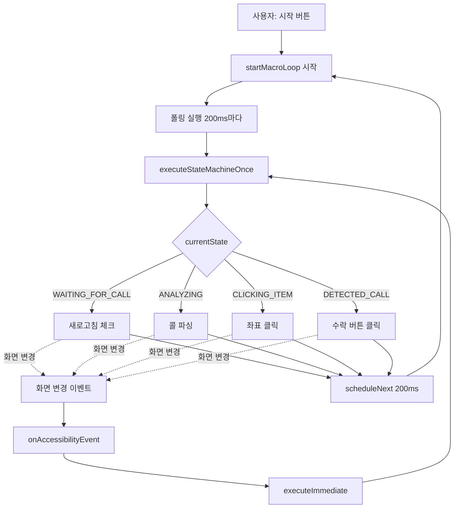
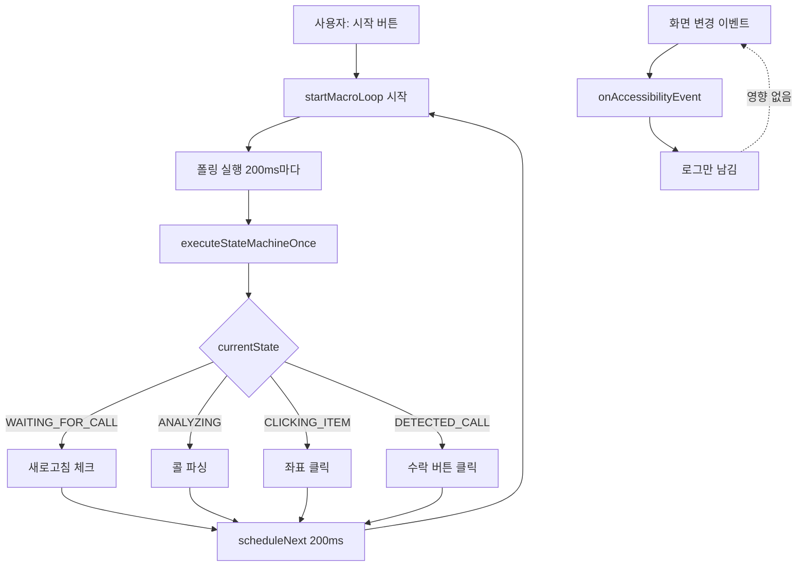

# executeImmediate() 수정 전/후 상태 다이어그램 비교

**작성일**: 2026-01-14
**목적**: "무한 루프" 문제의 정확한 이해

---

## 📋 목차

1. [문제의 정확한 정의](#문제의-정확한-정의)
2. [수정 전: 이중 실행 경로](#수정-전-이중-실행-경로)
3. [수정 후: 단일 실행 경로](#수정-후-단일-실행-경로)
4. [실제 시나리오 비교](#실제-시나리오-비교)

---

## 문제의 정확한 정의

### ❌ "무한 루프"는 틀린 표현

**제가 잘못 말한 것**:
```
"executeImmediate() 호출 → 무한 루프 발생"
```

**실제 문제**:
```
1. 이중 실행 경로 (폴링 + 이벤트)
2. Race Condition (동시 실행)
3. 과도한 실행 빈도
4. 예측 불가능한 State 전환
```

---

### ✅ 정확한 문제 설명

#### 1. 이중 실행 경로

```
경로 1: startMacroLoop() (폴링 - 200ms 주기)
  ↓
  executeStateMachineOnce()

경로 2: onAccessibilityEvent() (이벤트 - 화면 변경마다)
  ↓
  executeImmediate()
  ↓
  executeStateMachineOnce()

→ 동일한 메서드를 두 경로에서 호출!
```

---

#### 2. Race Condition 예시

```
시간: T
┌─────────────────────────────────────────┐
│ Thread: Main (Handler)                  │
│ startMacroLoop() 실행                    │
│   ↓                                     │
│ currentState = ANALYZING                │
│ executeStateMachineOnce()               │
│   ↓                                     │
│ parseReservationCalls() 시작...         │
└─────────────────────────────────────────┘

시간: T + 50ms (화면 변경 이벤트 발생)
┌─────────────────────────────────────────┐
│ Thread: Main (Handler)                  │
│ onAccessibilityEvent() 호출              │
│   ↓                                     │
│ executeImmediate() 호출                  │
│   ↓                                     │
│ currentState = ANALYZING (동일!)        │
│ executeStateMachineOnce()               │
│   ↓                                     │
│ parseReservationCalls() 시작... (중복!)  │
└─────────────────────────────────────────┘

결과:
- parseReservationCalls() 2번 실행
- 동일한 콜 2번 파싱
- cachedRootNode 동시 접근
- State 전환 충돌
```

---

#### 3. 과도한 실행 빈도

```
폴링만 (수정 후):
├─ 0ms: executeStateMachineOnce()
├─ 200ms: executeStateMachineOnce()
├─ 400ms: executeStateMachineOnce()
└─ ...

폴링 + 이벤트 (수정 전):
├─ 0ms: executeStateMachineOnce() (폴링)
├─ 50ms: executeStateMachineOnce() (이벤트 - 화면 변경)
├─ 120ms: executeStateMachineOnce() (이벤트 - 버튼 나타남)
├─ 200ms: executeStateMachineOnce() (폴링)
├─ 250ms: executeStateMachineOnce() (이벤트 - 클릭)
└─ ...

→ 실행 빈도가 2~3배 증가!
```

---

## 수정 전: 이중 실행 경로

### 전체 흐름



---

### 상세 시나리오: 새로고침 버튼 클릭

#### 시간 흐름표

| 시간 | 경로 | 이벤트/동작 | State | 비고 |
|------|------|------------|-------|------|
| 0ms | 폴링 | startMacroLoop() | WAITING_FOR_CALL | 폴링 시작 |
| 0ms | 폴링 | executeStateMachineOnce() | WAITING_FOR_CALL | 새로고침 시간 체크 |
| 0ms | 폴링 | click(0.96, 0.045) | → REFRESHING | 새로고침 버튼 클릭 |
| 50ms | 이벤트 | TYPE_WINDOW_CONTENT_CHANGED | REFRESHING | 화면 변경 감지 |
| 50ms | 이벤트 | executeImmediate() | REFRESHING | ⚠️ 이벤트 기반 실행 |
| 50ms | 이벤트 | executeStateMachineOnce() | REFRESHING | State 확인 |
| 100ms | 폴링 | executeStateMachineOnce() | REFRESHING | 100ms 경과 체크 |
| 100ms | 폴링 | changeState(ANALYZING) | → ANALYZING | State 전환 |
| 150ms | 이벤트 | TYPE_WINDOW_CONTENT_CHANGED | ANALYZING | 리스트 로드됨 |
| 150ms | 이벤트 | executeImmediate() | ANALYZING | ⚠️ 이벤트 기반 실행 |
| 150ms | 이벤트 | parseReservationCalls() | ANALYZING | 파싱 시작 (1회) |
| 200ms | 폴링 | executeStateMachineOnce() | ANALYZING | ⚠️ 폴링 실행 |
| 200ms | 폴링 | parseReservationCalls() | ANALYZING | **파싱 중복 (2회)** |

**문제점**:
1. **50ms**: 이벤트 기반 실행 (불필요)
2. **150ms**: parseReservationCalls() 1회 실행
3. **200ms**: parseReservationCalls() 2회 실행 (중복!)

---

### 코드 흐름

```kotlin
// 경로 1: 폴링 (startMacroLoop)
fun start() {
    _isRunning.value = true
    startMacroLoop()  // ← 폴링 시작
}

private fun startMacroLoop() {
    if (!_isRunning.value) return

    val delayMs = executeStateMachineOnce(cachedRootNode)  // ← 실행

    scheduleNext(delayMs ?: 200L) {
        startMacroLoop()  // ← 재귀 (200ms 후)
    }
}

// 경로 2: 이벤트 (onAccessibilityEvent)
override fun onAccessibilityEvent(event: AccessibilityEvent?) {
    // ...
    if (event.eventType == TYPE_WINDOW_CONTENT_CHANGED || ...) {
        val rootNode = rootInActiveWindow
        engine.executeImmediate(rootNode)  // ← 이벤트 기반 실행
    }
}

fun executeImmediate(node: AccessibilityNodeInfo) {
    if (!_isRunning.value) return
    cachedRootNode = node
    executeStateMachineOnce(node)  // ← 실행 (폴링과 동일 메서드!)
}

// 두 경로가 동일한 메서드 호출!
private fun executeStateMachineOnce(node: AccessibilityNodeInfo?): Long? {
    when (currentState.value) {
        ANALYZING -> {
            // parseReservationCalls() 실행
            // 폴링과 이벤트가 동시에 호출하면 2번 파싱!
        }
        // ...
    }
}
```

---

## 수정 후: 단일 실행 경로

### 전체 흐름



---

### 상세 시나리오: 새로고침 버튼 클릭 (수정 후)

#### 시간 흐름표

| 시간 | 경로 | 이벤트/동작 | State | 비고 |
|------|------|------------|-------|------|
| 0ms | 폴링 | startMacroLoop() | WAITING_FOR_CALL | 폴링 시작 |
| 0ms | 폴링 | executeStateMachineOnce() | WAITING_FOR_CALL | 새로고침 시간 체크 |
| 0ms | 폴링 | click(0.96, 0.045) | → REFRESHING | 새로고침 버튼 클릭 |
| 50ms | 이벤트 | TYPE_WINDOW_CONTENT_CHANGED | REFRESHING | 화면 변경 감지 |
| 50ms | 이벤트 | Log.d("KakaoT 이벤트: ...") | REFRESHING | ✅ 로그만 (무시) |
| 200ms | 폴링 | executeStateMachineOnce() | REFRESHING | 100ms 경과 체크 |
| 200ms | 폴링 | changeState(ANALYZING) | → ANALYZING | State 전환 |
| 400ms | 폴링 | executeStateMachineOnce() | ANALYZING | 콜 파싱 |
| 400ms | 폴링 | parseReservationCalls() | ANALYZING | **파싱 1회 (정상)** |
| 450ms | 이벤트 | TYPE_WINDOW_CONTENT_CHANGED | ANALYZING | 화면 변경 |
| 450ms | 이벤트 | Log.d("KakaoT 이벤트: ...") | ANALYZING | ✅ 로그만 (무시) |
| 600ms | 폴링 | executeStateMachineOnce() | ... | 다음 폴링 |

**개선점**:
1. ✅ **50ms, 450ms**: 이벤트 무시 (로그만)
2. ✅ **400ms**: parseReservationCalls() 1회만 실행
3. ✅ **중복 실행 없음**

---

### 코드 흐름

```kotlin
// 경로 1: 폴링만 (startMacroLoop)
fun start() {
    _isRunning.value = true
    startMacroLoop()  // ← 폴링 시작
}

private fun startMacroLoop() {
    if (!_isRunning.value) return

    val delayMs = executeStateMachineOnce(cachedRootNode)  // ← 실행

    scheduleNext(delayMs ?: 200L) {
        startMacroLoop()  // ← 재귀 (200ms 후)
    }
}

// 경로 2: 이벤트 - 로그만
override fun onAccessibilityEvent(event: AccessibilityEvent?) {
    // ... 인증, 패키지 체크 ...

    // ✅ 로그만 남김 (executeImmediate() 호출 안 함!)
    Log.d(TAG, "KakaoT 이벤트: ${event?.eventType}")
}

// executeStateMachineOnce()는 폴링에서만 호출됨
private fun executeStateMachineOnce(node: AccessibilityNodeInfo?): Long? {
    when (currentState.value) {
        ANALYZING -> {
            // parseReservationCalls() 실행
            // 폴링에서만 호출 → 중복 없음!
        }
        // ...
    }
}
```

---

## 실제 시나리오 비교

### 시나리오: 조건 충족 콜 발견 → 클릭 → 수락

#### 수정 전 (이중 실행)

```
시간 | 폴링 경로 | 이벤트 경로 | State | 문제점
-----|----------|------------|-------|--------
0ms  | startMacroLoop() | - | ANALYZING |
0ms  | parseReservationCalls() | - | ANALYZING | 파싱 시작
10ms | 조건 충족 콜 발견 | - | ANALYZING |
10ms | clickOnReservationCall() | - | → CLICKING_ITEM | 좌표 클릭
50ms | - | TYPE_WINDOW_CONTENT_CHANGED | CLICKING_ITEM | ⚠️ 화면 변경
50ms | - | executeImmediate() | CLICKING_ITEM | ⚠️ 이벤트 실행
50ms | - | executeStateMachineOnce() | CLICKING_ITEM | State 체크
100ms | executeStateMachineOnce() | - | CLICKING_ITEM | ⚠️ 폴링 실행
100ms | hasText("콜 수락") | - | CLICKING_ITEM | 버튼 체크
150ms | - | TYPE_WINDOW_STATE_CHANGED | CLICKING_ITEM | ⚠️ 화면 전환
150ms | - | executeImmediate() | CLICKING_ITEM | ⚠️ 이벤트 실행
200ms | executeStateMachineOnce() | - | CLICKING_ITEM | ⚠️ 폴링 실행
250ms | clickAcceptButton() | - | → DETECTED_CALL | 수락 버튼 클릭
300ms | - | TYPE_WINDOW_CONTENT_CHANGED | DETECTED_CALL | ⚠️ 화면 변경
300ms | - | executeImmediate() | DETECTED_CALL | ⚠️ 이벤트 실행

문제:
- 50ms, 150ms, 300ms에 이벤트 기반 실행
- executeStateMachineOnce() 호출 횟수: 7회 (폴링 4 + 이벤트 3)
- 불필요한 중복 체크
```

---

#### 수정 후 (단일 실행)

```
시간 | 폴링 경로 | 이벤트 경로 | State | 개선점
-----|----------|------------|-------|--------
0ms  | startMacroLoop() | - | ANALYZING |
0ms  | parseReservationCalls() | - | ANALYZING | 파싱 시작
10ms | 조건 충족 콜 발견 | - | ANALYZING |
10ms | clickOnReservationCall() | - | → CLICKING_ITEM | 좌표 클릭
50ms | - | Log.d("이벤트: ...") | CLICKING_ITEM | ✅ 로그만
200ms | executeStateMachineOnce() | - | CLICKING_ITEM | 폴링 실행
200ms | hasText("콜 수락") | - | CLICKING_ITEM | 버튼 체크
250ms | clickAcceptButton() | - | → DETECTED_CALL | 수락 버튼 클릭
300ms | - | Log.d("이벤트: ...") | DETECTED_CALL | ✅ 로그만
400ms | executeStateMachineOnce() | - | DETECTED_CALL | 폴링 실행

개선:
- 이벤트는 로그만 (무시)
- executeStateMachineOnce() 호출 횟수: 3회 (폴링만)
- 중복 없음, 예측 가능
```

---

## 📊 비교 요약

### 실행 빈도

| 구간 | 수정 전 | 수정 후 |
|------|--------|--------|
| 0~500ms | executeStateMachineOnce() **10회** (폴링 5 + 이벤트 5) | executeStateMachineOnce() **3회** (폴링만) |
| 실행 간격 | 평균 50ms | 평균 200ms |
| CPU 사용률 | 높음 | 낮음 |

---

### State 전환 안정성

| 항목 | 수정 전 | 수정 후 |
|------|--------|--------|
| **동시 실행** | 가능 (폴링 + 이벤트) | 불가능 (폴링만) |
| **State 충돌** | 가능 | 불가능 |
| **예측 가능성** | 낮음 | 높음 |
| **디버깅** | 어려움 | 쉬움 |

---

### 원본과의 일치도

| 항목 | TwinMe Original | 수정 전 | 수정 후 |
|------|----------------|--------|--------|
| **onAccessibilityEvent** | 로그만 | executeImmediate() | 로그만 ✅ |
| **실행 경로** | 폴링만 | 폴링 + 이벤트 | 폴링만 ✅ |
| **폴링 주기** | 100~200ms | 200ms | 200ms ✅ |
| **안정성** | 높음 | 낮음 | 높음 ✅ |

---

## 🎯 최종 결론

### ❌ "무한 루프"는 틀린 표현

실제 문제는:
1. **이중 실행 경로** (폴링 + 이벤트)
2. **Race Condition** (동시 실행 → State 충돌)
3. **과도한 실행** (CPU 사용률 2~3배)
4. **예측 불가능** (언제 어느 경로에서 실행될지 모름)

---

### ✅ 수정으로 얻은 효과

1. **단일 실행 경로** (폴링만)
2. **Race Condition 제거**
3. **CPU 사용률 감소** (실행 빈도 1/3)
4. **예측 가능** (200ms마다 폴링만)
5. **원본과 동일** (TwinMe Original 방식)

---

### 📈 State 다이어그램 흐름 개선

**수정 전**:
```
폴링(200ms) ──┐
              ├─→ executeStateMachineOnce() ← Race Condition!
이벤트(수시) ──┘
```

**수정 후**:
```
폴링(200ms) ──→ executeStateMachineOnce() ← 안정적!

이벤트(수시) ──→ Log.d(...) ← 무시
```

---

**결론**: "무한 루프"보다는 **"이중 실행으로 인한 불안정성"**이 정확한 표현입니다.
