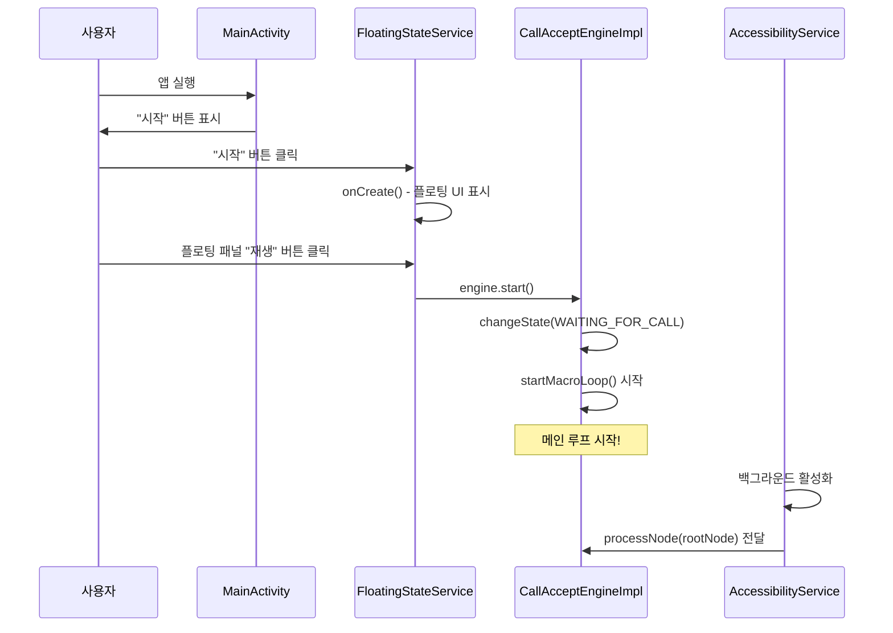
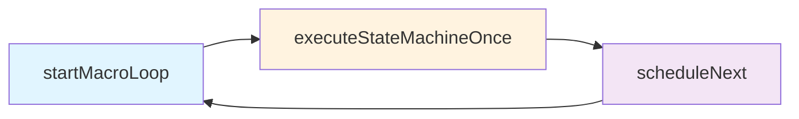
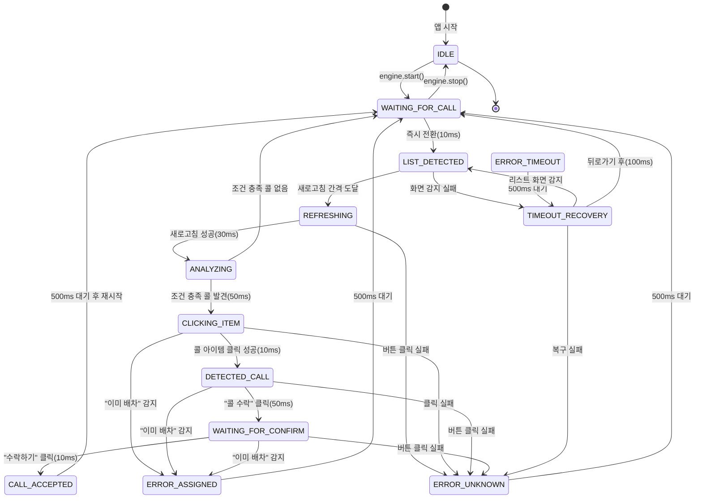
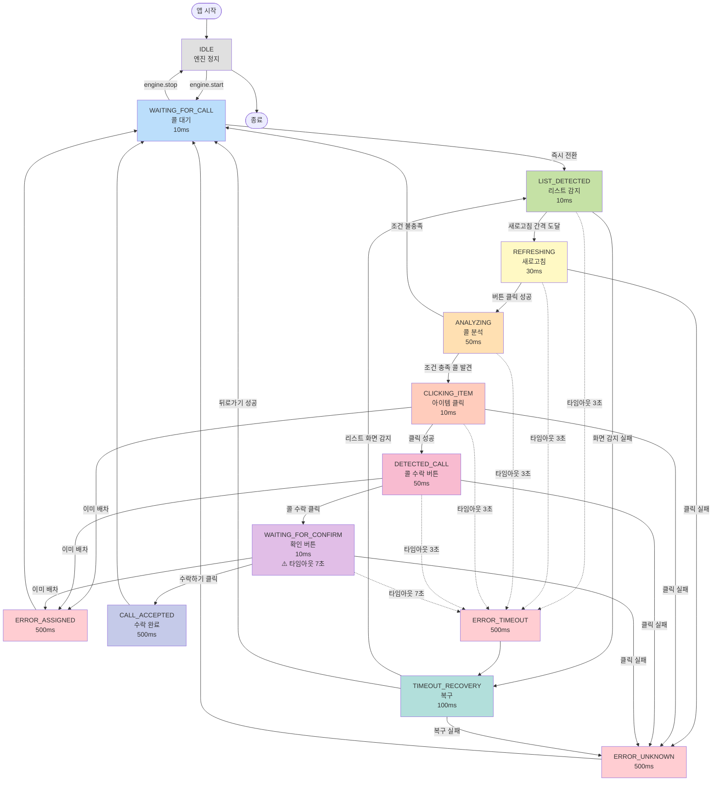
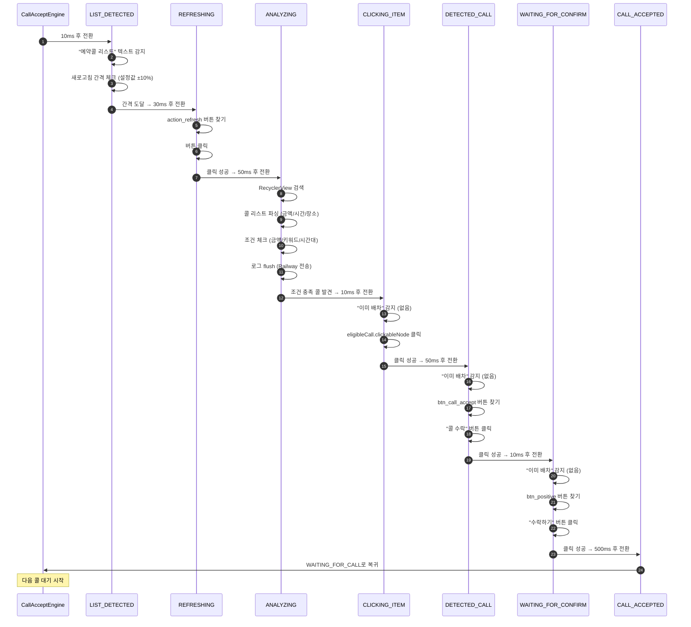
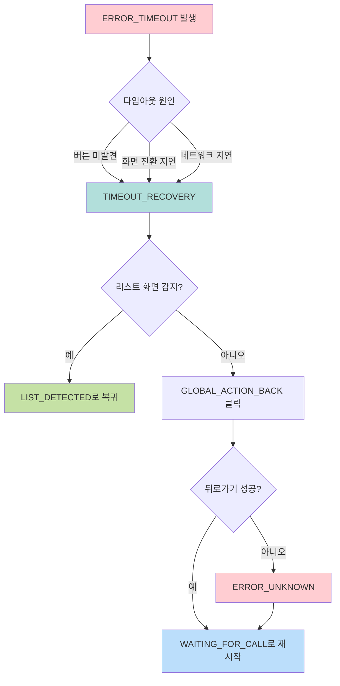
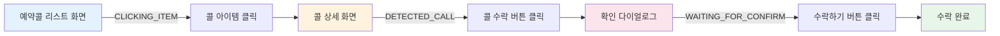

# Vortex 상태 머신 완전 참조 가이드

## 목차
1. [전체 실행 흐름](#1-전체-실행-흐름)
2. [상태별 상세 정보](#2-상태별-상세-정보)
3. [상태 전환 다이어그램](#3-상태-전환-다이어그램)
4. [타임아웃 및 실행 간격](#4-타임아웃-및-실행-간격)

---

## 1. 전체 실행 흐름

### 1.1 시작 지점



### 1.2 메인 루프 구조



**무한 반복 사이클:**
1. `startMacroLoop()` - 실행 조건 확인 및 화면 감지
2. `executeStateMachineOnce()` - 현재 상태 핸들러 실행
3. `scheduleNext(delayMs)` - 다음 실행 예약
4. 다시 1번으로 돌아감

### 1.3 주요 상태 전이



### 1.4 종료 지점

**종료 방법 1: 정지 버튼**
```
사용자 "정지" 클릭
→ FloatingService.engine.stop()
→ 메인 루프 중단 (startMacroLoop 재귀 중지)
→ 상태 IDLE로 변경
→ 엔진 대기 (재시작 가능)
```

**종료 방법 2: 종료 버튼**
```
사용자 "종료(X)" 클릭
→ FloatingService.stopSelf()
→ onDestroy() 실행
  - RemoteLogger.flushLogs() (버퍼 로그 전송)
  - windowManager.removeView(floatingView)
  - engine.stop()
→ 서비스 완전 종료
```

**종료 방법 3: 인증 만료**
```
AccessibilityService.onAccessibilityEvent()
→ authManager.isCacheValid() == false
→ disableSelf() (서비스 자동 비활성화)
→ Toast 메시지 표시
→ 앱 재실행 필요
```

---

## 2. 상태별 상세 정보

### 2.1 기본 상태

#### IDLE (대기 상태)

| 항목 | 내용 |
|------|------|
| **진입 조건** | • `engine.stop()` 호출 시<br>• 앱 초기 상태 |
| **허용된 행동** | • 아무 작업도 수행하지 않음<br>• `StateResult.NoChange` 반환 |
| **금지된 행동** | • 화면 감지 금지<br>• 버튼 클릭 금지<br>• 상태 전환 금지 |
| **return/중단 시 영향** | • 메인 루프 완전 중단<br>• 자동 콜 수락 중지<br>• 엔진 재시작 전까지 대기 |
| **다음 실행 간격** | 무한대 (Long.MAX_VALUE) |
| **타임아웃** | 없음 |

---

### 2.2 콜 감지 및 준비 상태

#### WAITING_FOR_CALL (콜 대기)

| 항목 | 내용 |
|------|------|
| **진입 조건** | • `engine.start()` 호출 시<br>• CALL_ACCEPTED 완료 후<br>• ERROR_ASSIGNED 발생 후<br>• ERROR_UNKNOWN 발생 후<br>• TIMEOUT_RECOVERY 복구 후<br>• ANALYZING에서 조건 충족 콜 없을 때 |
| **허용된 행동** | • 즉시 LIST_DETECTED로 전환만 수행<br>• 다른 작업 없음 |
| **금지된 행동** | • 화면 분석 금지<br>• 버튼 클릭 금지<br>• 조건 체크 금지 |
| **return/중단 시 영향** | • 다음 10ms 후 LIST_DETECTED 전환 못 함<br>• 메인 루프는 계속 돌지만 진행 안 됨 |
| **다음 실행 간격** | 10ms (즉시 전환) |
| **타임아웃** | 3초 → ERROR_TIMEOUT |

#### LIST_DETECTED (리스트 화면 감지)

| 항목 | 내용 |
|------|------|
| **진입 조건** | • WAITING_FOR_CALL에서 자동 전환<br>• TIMEOUT_RECOVERY에서 "예약콜 리스트" 화면 감지 시 |
| **허용된 행동** | • "예약콜 리스트" 텍스트 감지<br>• 새로고침 간격 확인 (설정값 ±10%)<br>• 조건 충족 시 REFRESHING으로 전환<br>• 미충족 시 대기 (`NoChange`) |
| **금지된 행동** | • 새로고침 버튼 클릭 금지<br>• 콜 분석 금지 |
| **return/중단 시 영향** | • 화면 감지 실패 시 TIMEOUT_RECOVERY로 전환<br>• 새로고침 타이밍 놓침 → 다음 루프에서 재시도 |
| **다음 실행 간격** | 10ms (빠른 체크) |
| **타임아웃** | 3초 → ERROR_TIMEOUT |

---

### 2.3 콜 분석 및 클릭 상태

#### REFRESHING (새로고침 중)

| 항목 | 내용 |
|------|------|
| **진입 조건** | • LIST_DETECTED에서 새로고침 간격 도달 시 |
| **허용된 행동** | • `com.kakao.taxi.driver:id/action_refresh` 버튼 찾기<br>• 버튼 클릭 수행<br>• 즉시 로깅 (`logRefreshAttempt`)<br>• ANALYZING으로 전환 |
| **금지된 행동** | • 콜 리스트 파싱 금지<br>• 조건 체크 금지 |
| **return/중단 시 영향** | • 버튼 미발견 시 ERROR_UNKNOWN 전환<br>• 클릭 실패 시 ERROR_UNKNOWN 전환<br>• 새로고침 실패 → 콜 리스트 갱신 안 됨 |
| **다음 실행 간격** | 30ms (원본 APK 타이밍) |
| **타임아웃** | 3초 → ERROR_TIMEOUT |

#### ANALYZING (콜 분석 중)

| 항목 | 내용 |
|------|------|
| **진입 조건** | • REFRESHING에서 새로고침 버튼 클릭 성공 시 |
| **허용된 행동** | • RecyclerView 검색<br>• 콜 리스트 파싱 (금액/시간/출발지/도착지/콜타입)<br>• 각 콜의 조건 충족 여부 확인<br>• 로그 즉시 flush (Railway 전송)<br>• 조건 충족 시 `context.eligibleCall`에 저장<br>• CLICKING_ITEM으로 전환 |
| **금지된 행동** | • 버튼 클릭 금지<br>• 화면 전환 금지 |
| **return/중단 시 영향** | • 파싱 실패 시 WAITING_FOR_CALL 복귀<br>• 조건 불충족 시 WAITING_FOR_CALL 복귀<br>• 콜 수락 기회 상실 |
| **다음 실행 간격** | 50ms (원본 APK 타이밍) |
| **타임아웃** | 3초 → ERROR_TIMEOUT |

**파싱 규칙:**
- 금액: `"15,000원"` 또는 `"15000원"` 패턴 매칭
- 시간: `"12.25(수) 14:30"` 형식 (날짜.날짜(요일) 시간:분)
- 장소: 출발지 → 도착지 순서
- 콜 타입: "일반 예약", "1시간 예약" 등

**조건 체크 (CONDITION_1_2 모드):**
- 조건1: 금액 >= 최소 금액
- 조건2: 키워드 포함 AND 금액 >= 키워드 최소 금액
- 둘 중 하나라도 통과하면 OK

**조건 체크 (CONDITION_3 모드):**
- 인천공항 출발 AND 금액 >= 공항 최소 금액

#### CLICKING_ITEM (콜 아이템 클릭)

| 항목 | 내용 |
|------|------|
| **진입 조건** | • ANALYZING에서 조건 충족 콜 발견 시 |
| **허용된 행동** | • `context.eligibleCall`에서 콜 정보 가져오기<br>• "이미 배차" 텍스트 감지<br>• 콜 아이템의 `clickableNode` 클릭<br>• 로깅 (`logAcceptStep` step=1)<br>• DETECTED_CALL로 전환 |
| **금지된 행동** | • 새로고침 금지<br>• 조건 재체크 금지 |
| **return/중단 시 영향** | • "이미 배차" 감지 시 ERROR_ASSIGNED 전환<br>• eligibleCall null이면 ERROR_UNKNOWN 전환<br>• 클릭 실패 시 ERROR_UNKNOWN 전환 |
| **다음 실행 간격** | 10ms (원본 APK 타이밍) |
| **타임아웃** | 3초 → ERROR_TIMEOUT |

---

### 2.4 콜 수락 프로세스 상태

#### DETECTED_CALL (콜 상세화면 진입)

| 항목 | 내용 |
|------|------|
| **진입 조건** | • CLICKING_ITEM에서 콜 아이템 클릭 성공 시 |
| **허용된 행동** | • "이미 배차" 텍스트 감지<br>• `com.kakao.taxi.driver:id/btn_call_accept` 버튼 찾기<br>• 버튼 미발견 시 텍스트 기반 검색:<br>&nbsp;&nbsp;- "콜 수락", "수락", "승낙", "accept"<br>• 버튼 클릭<br>• 로깅 (`logNodeClick`)<br>• WAITING_FOR_CONFIRM으로 전환 |
| **금지된 행동** | • 새로고침 금지<br>• 리스트 분석 금지<br>• 다른 콜 클릭 금지 |
| **return/중단 시 영향** | • "이미 배차" 감지 시 ERROR_ASSIGNED 전환<br>• 버튼 미발견 시 `NoChange` (대기)<br>• 클릭 실패 시 ERROR_UNKNOWN 전환<br>• 타임아웃 3초 초과 시 ERROR_TIMEOUT |
| **다음 실행 간격** | 50ms (버튼 감지 대기) |
| **타임아웃** | 3초 → ERROR_TIMEOUT |

**버튼 검색 우선순위:**
1. View ID: `btn_call_accept`
2. 텍스트: "콜 수락", "수락", "승낙", "accept"

#### WAITING_FOR_CONFIRM (확인 대기 중)

| 항목 | 내용 |
|------|------|
| **진입 조건** | • DETECTED_CALL에서 "콜 수락" 버튼 클릭 성공 시 |
| **허용된 행동** | • "이미 배차" 텍스트 감지<br>• `com.kakao.taxi.driver:id/btn_positive` 버튼 찾기<br>• 버튼 미발견 시 텍스트 기반 검색:<br>&nbsp;&nbsp;- "수락하기", "확인", "수락", "OK", "예", "Yes"<br>• 버튼 클릭<br>• 로깅 (`logNodeClick`)<br>• CALL_ACCEPTED로 전환 |
| **금지된 행동** | • 새로고침 금지<br>• 리스트 분석 금지<br>• 뒤로가기 금지 |
| **return/중단 시 영향** | • "이미 배차" 감지 시 ERROR_ASSIGNED 전환<br>• 버튼 미발견 시 `NoChange` (대기)<br>• 클릭 실패 시 ERROR_UNKNOWN 전환<br>• **타임아웃 7초** 초과 시 ERROR_TIMEOUT |
| **다음 실행 간격** | 10ms (빠른 확인) |
| **타임아웃** | **7초** → ERROR_TIMEOUT |

**버튼 검색 우선순위:**
1. View ID: `btn_positive`
2. 텍스트: "수락하기", "확인", "수락", "OK", "예", "Yes"

#### CALL_ACCEPTED (콜 수락 완료)

| 항목 | 내용 |
|------|------|
| **진입 조건** | • WAITING_FOR_CONFIRM에서 "수락하기" 버튼 클릭 성공 시 |
| **허용된 행동** | • 500ms 대기<br>• WAITING_FOR_CALL로 자동 전환 |
| **금지된 행동** | • 버튼 클릭 금지<br>• 화면 분석 금지 |
| **return/중단 시 영향** | • 다음 콜 대기 시작<br>• 로그 전송 완료 |
| **다음 실행 간격** | 500ms (다음 콜 준비 시간) |
| **타임아웃** | 없음 |

---

### 2.5 에러 및 복구 상태

#### ERROR_ASSIGNED (이미 배차됨)

| 항목 | 내용 |
|------|------|
| **진입 조건** | • CLICKING_ITEM, DETECTED_CALL, WAITING_FOR_CONFIRM에서<br>&nbsp;&nbsp;"이미 배차" 텍스트 감지 시 |
| **허용된 행동** | • 500ms 대기<br>• WAITING_FOR_CALL로 자동 전환 |
| **금지된 행동** | • 버튼 클릭 금지<br>• 복구 시도 금지 |
| **return/중단 시 영향** | • 해당 콜 수락 포기<br>• 다음 콜 탐색 시작 |
| **다음 실행 간격** | 500ms (재시도 간격) |
| **타임아웃** | 없음 |

#### ERROR_TIMEOUT (타임아웃)

| 항목 | 내용 |
|------|------|
| **진입 조건** | • 각 상태에서 타임아웃 초과 시:<br>&nbsp;&nbsp;- 기본 3초 (대부분 상태)<br>&nbsp;&nbsp;- WAITING_FOR_CONFIRM만 7초 |
| **허용된 행동** | • 500ms 대기<br>• TIMEOUT_RECOVERY로 자동 전환 |
| **금지된 행동** | • 버튼 클릭 금지<br>• 화면 분석 금지 |
| **return/중단 시 영향** | • 현재 진행 중단<br>• 복구 모드 진입 |
| **다음 실행 간격** | 500ms |
| **타임아웃** | 없음 |

#### ERROR_UNKNOWN (알 수 없는 오류)

| 항목 | 내용 |
|------|------|
| **진입 조건** | • 버튼 클릭 실패<br>• 파싱 실패<br>• 예상치 못한 오류 발생 시 |
| **허용된 행동** | • 500ms 대기<br>• WAITING_FOR_CALL로 자동 전환 |
| **금지된 행동** | • 복구 시도 금지<br>• 재클릭 금지 |
| **return/중단 시 영향** | • 현재 작업 포기<br>• 처음부터 다시 시작 |
| **다음 실행 간격** | 500ms (재시작 간격) |
| **타임아웃** | 없음 |

#### TIMEOUT_RECOVERY (타임아웃 복구)

| 항목 | 내용 |
|------|------|
| **진입 조건** | • ERROR_TIMEOUT 발생 시<br>• LIST_DETECTED에서 화면 감지 실패 시 |
| **허용된 행동** | • "예약콜 리스트" 텍스트 감지<br>• 감지 성공 시 LIST_DETECTED로 복귀<br>• 감지 실패 시 `GLOBAL_ACTION_BACK` 클릭<br>• WAITING_FOR_CALL로 재시작 |
| **금지된 행동** | • 버튼 클릭 금지 (뒤로가기 제외)<br>• 콜 분석 금지 |
| **return/중단 시 영향** | • 뒤로가기 실패 시 ERROR_UNKNOWN 전환<br>• 화면 복구 실패 시 무한 루프 가능 |
| **다음 실행 간격** | 100ms (복구 체크) |
| **타임아웃** | 없음 |

---

## 3. 상태 전환 다이어그램

### 3.1 전체 상태 흐름도



### 3.2 정상 흐름 (Happy Path)



### 3.3 에러 복구 흐름



---

## 4. 타임아웃 및 실행 간격

### 4.1 상태별 타임아웃 시간

| 상태 | 타임아웃 시간 | 타임아웃 발생 시 전환 |
|------|-------------|-------------------|
| IDLE | 없음 | - |
| WAITING_FOR_CALL | 3초 | ERROR_TIMEOUT |
| LIST_DETECTED | 3초 | ERROR_TIMEOUT |
| REFRESHING | 3초 | ERROR_TIMEOUT |
| ANALYZING | 3초 | ERROR_TIMEOUT |
| CLICKING_ITEM | 3초 | ERROR_TIMEOUT |
| DETECTED_CALL | 3초 | ERROR_TIMEOUT |
| **WAITING_FOR_CONFIRM** | **7초** | ERROR_TIMEOUT |
| CALL_ACCEPTED | 없음 | - |
| ERROR_ASSIGNED | 없음 | - |
| ERROR_TIMEOUT | 없음 | - |
| ERROR_UNKNOWN | 없음 | - |
| TIMEOUT_RECOVERY | 없음 | - |

**⚠️ 주의:** WAITING_FOR_CONFIRM 상태만 타임아웃이 7초로 설정되어 있습니다. (원본 APK 방식)

### 4.2 메인 루프 실행 간격 (상태별)

| 상태 | 다음 실행까지 지연 시간 | 비고 |
|------|---------------------|------|
| IDLE | 무한대 (Long.MAX_VALUE) | 메인 루프 중단 |
| WAITING_FOR_CALL | 10ms | 즉시 전환 |
| LIST_DETECTED | 10ms | 빠른 체크 |
| REFRESHING | 30ms | 원본 APK 타이밍 |
| ANALYZING | 50ms | 원본 APK 타이밍 |
| CLICKING_ITEM | 10ms | 원본 APK 타이밍 |
| DETECTED_CALL | 50ms | 버튼 감지 대기 |
| WAITING_FOR_CONFIRM | 10ms | 빠른 확인 |
| CALL_ACCEPTED | 500ms | 다음 콜 준비 시간 |
| TIMEOUT_RECOVERY | 100ms | 복구 체크 |
| ERROR_ASSIGNED | 500ms | 재시도 간격 |
| ERROR_TIMEOUT | 500ms | 복구 준비 |
| ERROR_UNKNOWN | 500ms | 재시작 간격 |

### 4.3 타이밍 다이어그램

```mermaid
gantt
    title 정상 흐름 타이밍 (1회 사이클)
    dateFormat X
    axisFormat %L ms

    section 초기화
    WAITING_FOR_CALL :0, 10

    section 화면 감지
    LIST_DETECTED :10, 20

    section 새로고침
    REFRESHING :20, 50

    section 분석
    ANALYZING :50, 100

    section 클릭
    CLICKING_ITEM :100, 110

    section 수락1
    DETECTED_CALL :110, 160

    section 수락2
    WAITING_FOR_CONFIRM :160, 170

    section 완료
    CALL_ACCEPTED :170, 670
```



**총 소요 시간 (정상 흐름):**
- 최소: 약 670ms (10+10+30+50+10+50+10+500)
- 실제: 1초 ~ 3초 (버튼 감지 대기 시간 포함)

---

## 5. 실제 카카오T 화면 흐름

### 5.1 화면별 클릭 대상



### 5.2 클릭 대상 상세

**1단계: 예약콜 리스트 화면**
- RecyclerView에 여러 콜이 카드 형태로 표시
- 각 카드: 출발지, 도착지, 금액, 예약 시간 포함
- CLICKING_ITEM에서 클릭하는 것: 전체 카드/아이템

**2단계: 콜 상세 화면**
- 클릭 시 상세 정보 표시
- 하단에 큰 "콜 수락" 버튼
- View ID: `com.kakao.taxi.driver:id/btn_call_accept`
- 대체 텍스트: "콜 수락", "수락", "승낙", "accept"

**3단계: 확인 다이얼로그**
- "콜을 수락하시겠습니까?" 팝업
- 우측 하단 "수락하기" 버튼
- View ID: `com.kakao.taxi.driver:id/btn_positive`
- 대체 텍스트: "수락하기", "확인", "수락", "OK", "예", "Yes"

---

## 6. 코드 참조

### 6.1 핵심 파일

| 파일 | 설명 | 라인 참조 |
|------|------|----------|
| `CallAcceptState.kt` | 모든 상태 정의 | 14-37 |
| `CallAcceptEngineImpl.kt` | 메인 루프 및 상태 관리 | 152-293 |
| `StateHandler.kt` | 상태 핸들러 인터페이스 | - |
| `StateResult.kt` | 상태 전환 결과 정의 | - |
| `StateContext.kt` | 핸들러 의존성 컨테이너 | - |

### 6.2 핸들러 파일

| 핸들러 | 파일 | 담당 상태 |
|--------|------|----------|
| IdleHandler | `handlers/IdleHandler.kt` | IDLE |
| WaitingForCallHandler | `handlers/WaitingForCallHandler.kt` | WAITING_FOR_CALL |
| ListDetectedHandler | `handlers/ListDetectedHandler.kt` | LIST_DETECTED |
| RefreshingHandler | `handlers/RefreshingHandler.kt` | REFRESHING |
| AnalyzingHandler | `handlers/AnalyzingHandler.kt` | ANALYZING |
| ClickingItemHandler | `handlers/ClickingItemHandler.kt` | CLICKING_ITEM |
| DetectedCallHandler | `handlers/DetectedCallHandler.kt` | DETECTED_CALL |
| WaitingForConfirmHandler | `handlers/WaitingForConfirmHandler.kt` | WAITING_FOR_CONFIRM |
| TimeoutRecoveryHandler | `handlers/TimeoutRecoveryHandler.kt` | TIMEOUT_RECOVERY |

### 6.3 메인 루프 코드 참조

**CallAcceptEngineImpl.kt:**
```kotlin
// 라인 152-186: startMacroLoop()
// 라인 194-271: executeStateMachineOnce()
// 라인 280-292: scheduleNext()
// 라인 369-385: getDelayForState()
```

---

## 7. 문제 해결 가이드

### 7.1 일반적인 문제

**Q1: 콜 수락이 안 돼요**
- LIST_DETECTED에서 "예약콜 리스트" 텍스트 감지 확인
- ANALYZING에서 조건 체크 로그 확인 (금액/키워드/시간대)
- DETECTED_CALL/WAITING_FOR_CONFIRM에서 버튼 View ID 확인

**Q2: 타임아웃이 자주 발생해요**
- 네트워크 지연 확인
- KakaoT 앱 버전 확인 (View ID 변경 가능)
- 타임아웃 시간 조정 (3초 → 5초)

**Q3: "이미 배차" 에러가 계속 떠요**
- 다른 기사가 먼저 수락한 콜
- 정상 동작입니다 (ERROR_ASSIGNED → WAITING_FOR_CALL 복귀)

**Q4: 메인 루프가 멈춰요**
- IDLE 상태인지 확인 (`engine.isRunning == false`)
- AccessibilityService 활성화 확인
- 인증 캐시 만료 확인

### 7.2 디버깅 팁

**로그 확인:**
```bash
adb logcat -s CallAcceptEngineImpl WaitingForCallHandler AnalyzingHandler
```

**상태 추적:**
```kotlin
// FloatingStateService에서 실시간 상태 표시
engine.currentState.collect { state ->
    Log.d("StateFlow", "현재 상태: $state")
}
```

**Railway 로그 확인:**
- https://mediaenhanced-v10-production-011.up.railway.app/api/twinme/logs
- 이벤트: AUTH, STATE_CHANGE, NODE_CLICK, CALL_RESULT, BATCH_LOG

---

## 8. 버전 히스토리

| 버전 | 날짜 | 변경 내용 |
|------|------|----------|
| 1.0 | 2025-01-04 | 초기 작성 - 전체 상태 머신 문서화 |

---

**문서 작성:** Claude Code
**최종 업데이트:** 2025-01-04
**참조:** `docs/STATE_PATTERN.md`, `docs/WORKFLOW.md`
